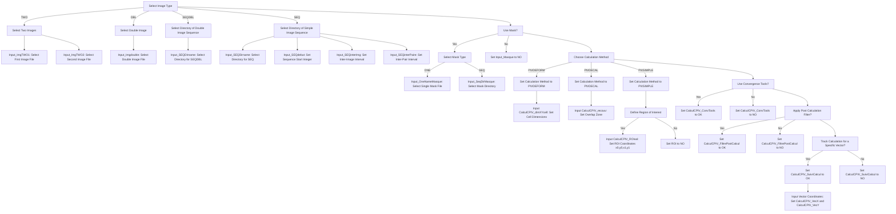

# PIV CALCUL - README
        ██████╗ ██╗██╗   ██╗     ██████╗ █████╗ ██╗      ██████╗██╗   ██╗██╗     
        ██╔══██╗██║██║   ██║    ██╔════╝██╔══██╗██║     ██╔════╝██║   ██║██║     
        ██████╔╝██║██║   ██║    ██║     ███████║██║     ██║     ██║   ██║██║     
        ██╔═══╝ ██║╚██╗ ██╔╝    ██║     ██╔══██║██║     ██║     ██║   ██║██║     
        ██║     ██║ ╚████╔╝     ╚██████╗██║  ██║███████╗╚██████╗╚██████╔╝███████╗
        ╚═╝     ╚═╝  ╚═══╝       ╚═════╝╚═╝  ╚═╝╚══════╝ ╚═════╝ ╚═════╝ ╚══════╝
                                                                             
*(ver 1.0) by Alexandre Le Mentec, 11/2024*

## Description:
The goal of this program is to generate an input file for a PIV computation software. It's a simple step by step form filler that checks the values and variables needed for the computation, check their validity and create an input file with the right File structure.

A mermaid state diagram describing all the possible variables is provided at the end of this document to guide your choice.

## Dependecies and installation
The UI is based off **tkinter** on **python 3.11** and necessitate the instalation of the following non-native libraries:
> -**tk** *(tkinter)*\
> -**ttk** \
> -**ttkthemes** *(for visual aspects)*

In term of file organization, the tarball provided should be organized in the right disposition for the file to work together, but in case of faulty installation, here is the file structure:

> **Main file** *(file)*
> - UI_run.py
> - image.py
> - calcul.py
>> **RESULT** *(file)*
>> - Result_will_be_saved_here.txt

## How to use it
to use it, just run the **UI_run.py** file using **python 3.11** while being in the main file containing all the python files:

### On linux
```bash
python3 UI_run.py
```
### On Window
```bash
python UI_run.py
```

After that, the UI should open after a few seconds. 
Just fill in the values until no entry box or choice box is left empty. 
After that, click on the $\boxed{\textbf{SAVE}}$ button.
An text window should appear next to the main window, notifying you of possible errors made during the filling process, or if the latter worked, the name of the input file created.

You will then be able to find the said input file in the **RESULT** file.

Here is a map of all the possible variables you'll need to input depending on your choices
> (NB: This map is made using the mermaid markdown extension and will not appear if the interface you're using doesn't support it)

